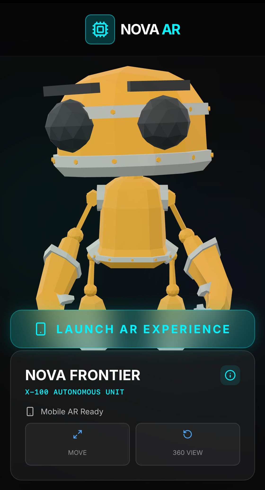
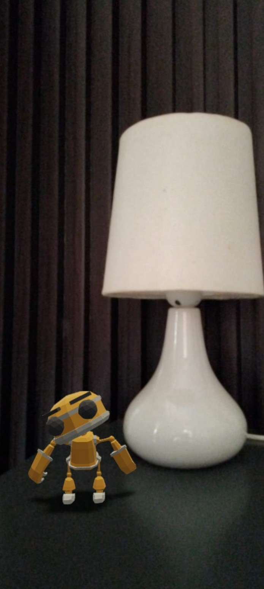

# Nova AR — Futuristic WebAR 3D Viewer

Nova AR is a modern mobile-first WebAR application built using React, Vite, Tailwind CSS, and `@google/model-viewer`. The application allows users to visualize and interact with 3D models directly in Augmented Reality through their mobile browser.

The project is optimized for both Android and iOS devices using WebXR, Scene Viewer, and Quick Look support.

---

## Features

- Cross-platform AR support (Android & iOS)
- Interactive 3D model viewer
- Rotate, zoom, and move 3D objects
- WebXR integration
- Fast Vite-powered performance
- Modern glassmorphism UI
- Smooth animations using Framer Motion
- GLB and USDZ model support
- Mobile-first responsive design
- Vercel deployment ready

---

## Tech Stack

| Technology | Purpose |
|---|---|
| React.js | Frontend Framework |
| Vite | Fast Build Tool |
| Tailwind CSS | Styling |
| Framer Motion | UI Animations |
| @google/model-viewer | 3D & AR Rendering |
| WebXR | AR Experience |
| Vercel | Deployment |

---

## Screenshots

### Home Screen



---

### AR Viewer



---

## Project Structure

```bash
src/
│
├── components/
│   ├── ModelViewer.jsx
│   ├── Loader.jsx
│   ├── InfoPanel.jsx
│   └── Navbar.jsx
│
├── assets/
│   └── models/
│       ├── robot.glb
│       └── robot.usdz
│
├── App.jsx
└── main.jsx
```

---

## Installation & Setup

### Clone Repository

```bash
git clone https://github.com/your-username/nova-ar.git
```

---

### Navigate to Project

```bash
cd nova-ar
```

---

### Install Dependencies

```bash
npm install
```

---

### Start Development Server

```bash
npm run dev
```

---

## Testing on Mobile

1. Connect your mobile device and laptop to the same WiFi network.
2. Run the development server.
3. Open the local network URL on your mobile browser.

Example:

```bash
http://192.168.x.x:5173
```

---

## AR Support

| Platform | Technology Used |
|---|---|
| Android | Scene Viewer / WebXR |
| iPhone (iOS) | Quick Look |

---

## Deployment

The project is deployed using Vercel for secure HTTPS support required by WebAR.

### Deploy to Vercel

1. Push project to GitHub
2. Import repository into Vercel
3. Deploy

---

## Key Highlights

- Built reusable React components with scalable architecture
- Implemented cross-platform WebAR support
- Optimized 3D asset loading performance
- Created a futuristic glassmorphism UI
- Configured secure deployment for camera permissions
- Added responsive interactions for mobile devices

---

## Future Improvements

- Multiple 3D model selection
- Dynamic environment lighting
- Gesture tutorials
- Audio integration
- AR object annotations
- Real-time multiplayer AR

---

## Author

Gaurav

Frontend Developer passionate about building modern UI/UX experiences and interactive web applications.

---

## License

This project is for educational and portfolio purposes.
